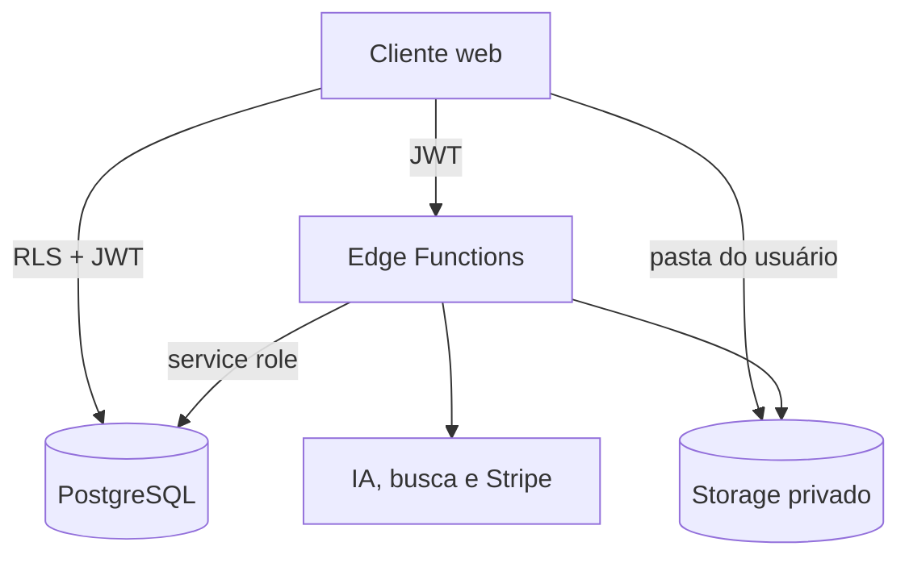

# Arquitetura de produção

## Fronteiras de confiança

O navegador usa apenas a URL e a chave anônima do Supabase. Todas as operações com custo, segredo ou acesso externo passam por uma Edge Function autenticada. A service role nunca é enviada ao cliente.

## Multiempresa e isolamento

- `organizations` representa a conta comercial.
- `organization_members` define owner, admin, member e viewer.
- `subscriptions` centraliza plano, ciclo e saldo da organização.
- `profiles.default_organization_id` seleciona o workspace atual.
- `assets` guarda o autor e a organização, mas as políticas dão acesso **somente ao autor**. Compartilhamento futuro deve usar uma tabela explícita, nunca relaxar essa política.
- O navegador recebe privilégios diretos somente de `SELECT`, `INSERT`, `UPDATE` e `DELETE` em `assets`; plano, saldo e relações multiempresa são lidos pelo RPC autenticado `get_user_plan`.
- Helpers usados por RLS vivem no schema não exposto `private`, verificam `auth.uid()` internamente e usam `search_path` vazio.

## Geração

1. O cliente envia ação, contexto e `request_id` à `ai-proxy`.
2. `authorize_generation` bloqueia a assinatura, valida plano e rate limit, deduz créditos e grava o ledger na mesma transação; `request_id` repetido é rejeitado antes de uma nova chamada ao provedor.
3. A função escolhe modelos configurados pelo operador e tenta fallback sem aceitar URL ou modelo arbitrário do cliente.
4. A saída JSON é validada no proxy e novamente pelo contrato Zod no cliente.
5. Falha total aciona `refund_generation`; a chave única por usuário, request e tipo impede débito ou estorno duplicado.

Prompts e conteúdo gerado não são persistidos em logs de uso.

## Ciclo diário de créditos

- `private.reset_daily_credits` repõe, de forma idempotente, cada workspace ativo ao limite definido em `plan_catalog`.
- O job `brieflow-reset-daily-credits` roda às 03:00 UTC, equivalente a 00:00 em `America/Sao_Paulo`.
- `get_user_plan` e `authorize_generation` também executam a verificação sob lock. Assim, uma falha ou atraso do Cron é reparado antes de exibir ou consumir o saldo.
- Cada reposição que aumenta o saldo gera uma entrada `grant` no `credit_ledger`; o período mensal do Stripe permanece independente.

## Conteúdo avançado

Documentos e planos técnicos de mídia usam `StructuredContentDocument`: título, resumo, duração, seções, timing, direção visual, notas, CTA, palavras-chave e ressalvas. Para Reel, vídeo e podcast, essa estrutura fica interna e alimenta `media-render`; o usuário recebe a mídia final, que é persistida no Storage privado antes da reprodução ou exportação.

## Escala

- limites por minuto são contadores atômicos por usuário;
- débitos usam row locks e idempotência;
- biblioteca usa paginação por cursor em lotes de 50 itens, com ordenação estável e índice por usuário/data/ID;
- o primeiro salvamento cria o asset e os seguintes atualizam o mesmo ID, evitando cópias acidentais e consumo indevido da cota;
- scraping usa cache de quatro horas;
- webhooks Stripe usam claim atômico, lease de recuperação e ordenação pelo timestamp assinado do evento;
- mídia é armazenada em vez de embutida em JSON e tem limite de 10 MB;
- payload de campanha tem limite de 2 MB.

Para volumes superiores, a evolução natural é fila assíncrona para vídeo renderizado, observabilidade centralizada e réplicas de leitura. Essas mudanças não exigem alterar o contrato atual de assets.
